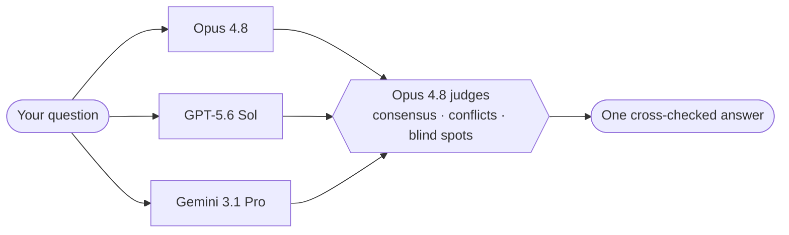
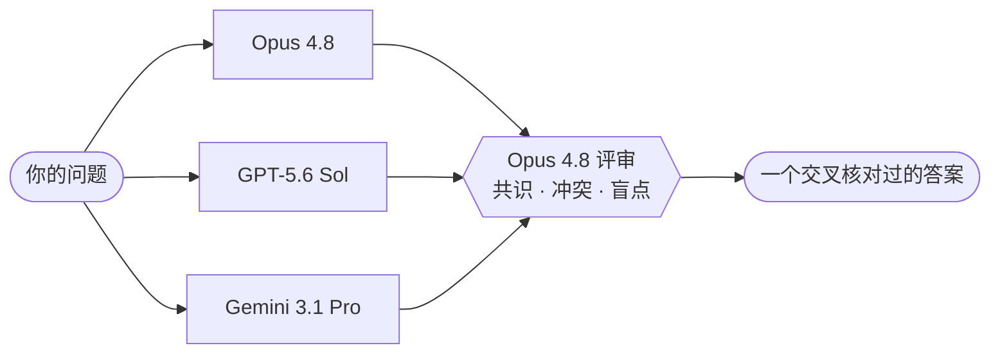

# fusion-deck

<p align="center">
  
</p>

> 🃏 Three B-tier models gang up and out-argue the one A-tier star.
> A Claude Code skill that turns a panel of models into one judged answer — plus a workflow toolkit that
> plans, investigates, gathers context, splits, optimizes, refactors, and hands off.


**English** · [简体中文](#简体中文)

---

## The story

OpenRouter published a fun result: a **panel of models, judged by one of them, beats the best single
frontier model** (“Fusion beats frontier”). Two snags with just using theirs:

1. The single strongest model in that test — **Claude Fable 5 — is off the table for me. I can't run it.**
2. OpenRouter's Fusion is a **metered API**: every call costs.

So fusion-deck does the same trick, **on your own machine**: it rounds up **three models you already pay a
flat subscription for** — Claude Opus 4.8, GPT‑5.6 Sol (via the `codex` CLI), and Gemini 3.1 Pro (via
Antigravity CLI `agy`; legacy `gemini` is opt-in) — has Opus 4.8 judge them, and **beats the lone star
anyway**. No extra per‑token API meter:
it just rides the CLIs you're already logged into. Three cobblers, one Zhuge Liang. 🧠



> **The catch:** the full panel needs all three subscriptions/CLIs. Missing one? No drama — it runs with
> whatever you've got and always tells you exactly which models answered.

## The evidence (OpenRouter's measurement, not ours)

OpenRouter measured this **model configuration** on their **DRACO** deep‑research benchmark — 100 tasks
across 10 domains. To be precise about what's claimed: these numbers are OpenRouter's, for their Fusion
pipeline over the same models — fusion-deck runs the same panel shape locally but has **not** been
independently benchmarked (different judge scaffolding, CLI-subscription model variants):

| Setup | DRACO | vs. best solo model |
| --- | --- | --- |
| 🃏 **the same panel fusion-deck runs** — Opus 4.8 + GPT‑5.6 Sol + Gemini 3.1 Pro, judged by Opus 4.8 | **68.3%** | **+3.0** 🟢 |
| Opus 4.8 + GPT‑5.6 Sol, judged by Opus 4.8 | 67.6% | +2.3 |
| 🌟 Claude Fable 5 — the lone star, solo | 65.3% | — _(baseline)_ |
| GPT‑5.6 Sol, solo | 60.0% | −5.3 |
| Opus 4.8, solo | 58.8% | −6.5 |

The three underdogs land **68.3% — that's +3.0 over the star (Fable 5) and ~+9.5 over Opus 4.8 on its
own.** Three independent tries catch each other's mistakes; even the *same* model run twice and judged
jumps +6.7. Not luck — that's the whole point.

*Data: OpenRouter, “[Fusion beats frontier](https://openrouter.ai/blog/announcements/fusion-beats-frontier/).”
fusion-deck runs the same panel locally via Claude, `codex`, and `agy` — no router, nothing
leaves for a third party.*

## Two superpowers

**① Think hard — open the panel.**
`/fusion <question>` and `/fusion-review <code or diff>` fan your question (or your code) out to the panel,
blind and in parallel, then Opus 4.8 judges it into **one cross‑checked answer** — or one prioritized
findings list, must‑fix first. For the calls where being confidently wrong is expensive.

**v2 adds a router.** `/fusion-auto <task>` picks the workflow first — single worker, verified worker,
intentional pair, full panel, or ultra — and records a local run ledger under `.fusion/runs/`. `/fusion`
still means "open the full panel"; `/fusion-auto` is the smarter default when you want quality without
unnecessary calls.

**② Work smart — run the workflow.** This is the part people sleep on:

- 🧩 **`/fusion-plan <one fuzzy line>`** → a real plan: the goal, a concrete “done‑when”, the steps, the
  risks. Stop hand‑holding the AI through vague asks — pin down what you actually meant first.
- 📦 **`/fusion-context <task>`** → a tidy, **token‑budgeted context pack of only the files that matter**.
  The model finally reasons about your real code instead of drowning in the whole repo.
- 🔀 **`/fusion-orchestrate <task>`** → **splits the work into pieces, runs each in a focused sub‑agent, and
  verifies each one before starting the next.** Big changes done carefully — not one hopeful mega‑prompt.
- 🔎 **`/fusion-investigate <bug or "why is it like this">`** → evidence first, then the panel adjudicates
  the competing theories. A root‑cause report, not a confident guess.
- ⏱️ **`/fusion-optimize <metric>`** → a measure → change → re‑measure loop: baseline first, one change at a
  time, the panel calls continue/stop. No baseline, no bragging.
- ♻️ **`/fusion-refactor <target>`** → structure analysis → behavior‑preserving plan → one steered agent.
  Cleaner code, same behavior (proven by the tests that stay green).
- 🤝 **`/fusion-handoff <work>`** → a clean handoff note (done / verified / risks / next steps) so the next
  agent — or future‑you — picks up in seconds.

**Power-user modes:** `/fusion-plan --deep` (a polished design doc with a critique pass) · `/fusion-context
--discover` (let an agent curate the pack, evidence-gated) · `/fusion-orchestrate --worktrees` (isolate
parallel siblings in their own git worktrees). All opt-in; the plain commands stay simple.

Chain them and you go from a vague one‑liner to a verified, shipped change:

```text
fuzzy idea → /fusion-plan → /fusion-context → /fusion-orchestrate → /fusion-handoff
```

Under the hood it's tuned to actually *get* you: panelists answer **blind** (no echo chamber), the judge
**reconciles** consensus vs. contradictions (it doesn't average), context is **curated not dumped**, and
every step is **verified before the next**.

## Which command? (when to use what)

Not sure which to reach for? Match your situation below — and when the task is easy, just ask Claude
directly; the panel is for the calls where being wrong is expensive.

| When you're trying to… | Reach for | Panel? |
| --- | --- | --- |
| Settle a hard call or trade-off (*"optimistic or pessimistic locking?"*) | `/fusion` · `--wide` adds a 2nd cold Opus (4 panelists) | yes |
| Let the system choose the right workflow and escalate only when needed | `/fusion-auto` | router decides |
| Maximize quality on a hard/high-risk task with targeted second-round probes | `/fusion-ultra` — round 1 is **wide** (Opus ×2 + GPT + Gemini) | yes |
| Vet code, a diff, or a plan before it ships | `/fusion-review` | yes |
| Find the root cause of a bug, or *"why is it built like this?"* | `/fusion-investigate` | by exception |
| Turn a vague idea into a concrete, checkable plan | `/fusion-plan` · `--deep` for a design doc | no |
| Hand the *right* files to another model or agent | `/fusion-context` · `--discover` to auto-curate | no |
| Execute a big, multi-step change carefully | `/fusion-orchestrate` · `--worktrees` to parallelize | no |
| Make something measurably faster or smaller | `/fusion-optimize` | by exception |
| Clean up structure **without** changing behavior | `/fusion-refactor` | no |
| Pass work to the next agent (or future-you) | `/fusion-handoff` | no |
| Re-anchor a drifting session (situation→command + invariants) | `/fusion-remind` | no |

Typical flows: a **feature** is `plan → context → orchestrate → handoff`; a **bug** is
`investigate → plan → orchestrate`. A one-off hard question is just `/fusion`.

## Install

```bash
git clone https://github.com/raydocs/fusion-deck.git
bash fusion-deck/install.sh
```

Then run **`/reload-skills`** in Claude Code (or restart). Done — `/fusion`, `/fusion-auto`,
`/fusion-ultra`, `/fusion-plan`, … are ready.

**For the full 3‑model panel**, install the two optional CLIs (and be logged into each):

- [`codex`](https://developers.openai.com/codex) — adds the GPT‑5.6 Sol panelist
- [`agy`](https://antigravity.google/docs/cli-install) — adds the Gemini 3.1 Pro panelist via Antigravity CLI
  - Legacy `gemini` is still available only when explicitly enabled with `FUSION_GEMINI_BACKEND=gemini`
    or `FUSION_ALLOW_LEGACY_GEMINI=1`.

Check anytime:

```bash
bash ~/.claude/skills/fusion-deck/scripts/detect_panel.sh   # which models are available right now
bash ~/.claude/skills/fusion-deck/scripts/smoke_test.sh     # offline self-check (never calls a paid model)
```

## Examples

```text
/fusion Should we use optimistic or pessimistic locking for the booking flow? Trade-offs at our scale.
/fusion-auto review my staged diff
/fusion-ultra review this auth migration plan
/fusion-review git diff main...HEAD
/fusion-investigate the cart total is wrong for multi-currency orders
/fusion-plan add a /health endpoint with a test
/fusion-context the checkout flow, so I can hand it to another agent
/fusion-orchestrate docs/plans/add-health.md
/fusion-optimize cut p95 latency of /search under load; stop at 200ms
/fusion-refactor the payments module
/fusion-handoff the auth refactor
```

## Good to know

- **Where the savings come from.** It reuses the subscriptions you're already logged into (Claude /
  `codex` / Antigravity `agy`) — no per‑token API bill the way OpenRouter's Fusion API charges. *You just
  need the three subscriptions.* The full panel costs more quota and runs as slow as its slowest model, so only
  `/fusion`, `/fusion-ultra`, and `/fusion-review` open the whole table by default. `/fusion-auto` starts
  cheaper and escalates when risk, conflict, or verification says the extra calls are worth it.
- **Nothing is faked.** Every panel answer states which models actually answered; a smaller panel is never
  dressed up as the full one. That holds at runtime too: a panelist that rate-limits, times out, or
  returns a tiny error banner mid-run makes the runner exit **13** with an honest manifest — the run
  stops and discloses instead of quietly shipping a smaller panel (unless you set
  `FUSION_ALLOW_DEGRADED=1`).
- **No secrets in the repo.** Auth lives in the CLIs; nothing private is hardcoded. The local run ledger
  (`.fusion/runs/`) writes a self-ignoring `.gitignore` so panel prompts (which can embed a diff under
  review) never end up in a commit.
- **Env knobs.** `FUSION_PANEL_TIMEOUT` (s, default 600) hard-bounds each panelist; `FUSION_VERIFIER_TIMEOUT`
  (s, default 900) bounds verifier commands; `FUSION_MAX_PROMPT_BYTES` (default 400000) refuses oversized
  packets; `FUSION_MIN_OUTPUT_BYTES` (default 200) treats error-banner-sized outputs as failures;
  `FUSION_NO_WEB=1` runs the codex panelist read-only with no web tool (the default posture for
  `/fusion-review`, whose packet is untrusted content); `FUSION_ALLOW_DEGRADED=1` knowingly accepts a
  smaller panel. Each accepts `0` to disable where applicable.

## License

[MIT](LICENSE)

---

## 简体中文

> 🃏 三个臭皮匠合起来，比那个独苗状元还能打——这回状元叫 Fable。
> 一个 Claude Code 技能：把一桌模型拧成一个被评审过的答案，外加一套会规划、会查根因、会备上下文、会拆活、会调优、会重构、会交接的工作流。

[English](#fusion-deck) · **简体中文**

### 来历

OpenRouter 发了个挺好玩的结论：**一桌模型 + 其中一个当评审，分数能压过最强的单个前沿模型**（《Fusion beats frontier》）。但直接用他们的有俩坎：

1. 那场里最能打的单模型 —— **Claude Fable 5，我这儿根本用不了，被封了。**
2. OpenRouter 的 Fusion 是 **按量计费的 API**：一调一掏钱。

所以 fusion-deck 把这套搬到**你自己电脑上**：拉上**三个你本来就按月订阅、早就登录好的模型** —— Claude Opus 4.8、GPT‑5.6 Sol（走 `codex`）、Gemini 3.1 Pro（默认走 Antigravity CLI `agy`，旧 `gemini` 只做显式兼容）—— 让 Opus 4.8 当评审，**照样把那个单飞的状元比下去**。不额外按 token 收费，直接复用你已经登录的订阅。三个臭皮匠，顶个诸葛亮。🧠



> **小前提：** 想凑齐整桌，你得有这三家的订阅 / CLI。少一个也不耽误 —— 它会用现有的接着跑，而且每次都老老实实告诉你这回到底上了谁。

### 佐证（OpenRouter 的实测，不是我们的）

OpenRouter 在他们的 **DRACO** 深度研究基准（10 个领域、100 道题）上实测了**这套模型阵容**。把话说准：
下面的数字是 OpenRouter 对他们自家 Fusion 管线的测量；fusion-deck 在本地跑的是同样的阵容形状，但
**没有**独立跑过基准（评审脚手架不同、CLI 订阅版模型也有差异）：

| 配置 | DRACO | 比最强单模型 |
| --- | --- | --- |
| 🃏 **与 fusion-deck 相同的阵容** —— Opus 4.8 + GPT‑5.6 Sol + Gemini 3.1 Pro，Opus 4.8 评审 | **68.3%** | **+3.0** 🟢 |
| Opus 4.8 + GPT‑5.6 Sol，Opus 4.8 评审 | 67.6% | +2.3 |
| 🌟 Claude Fable 5 —— 独苗状元，单飞 | 65.3% | —（基准） |
| GPT‑5.6 Sol，单飞 | 60.0% | −5.3 |
| Opus 4.8，单飞 | 58.8% | −6.5 |

三个臭皮匠落在 **68.3% —— 比状元 Fable 5（65.3%）高 3.0 分**，比 Opus 4.8 单飞高了将近 9.5 分。三次各自独立的尝试会互相挑错；哪怕同一个模型跑两遍再合并，也能高 6.7 分。不是运气，这就是整件事的核心。

*数据来自 OpenRouter 的《[Fusion beats frontier](https://openrouter.ai/blog/announcements/fusion-beats-frontier/)》（DRACO 基准）。fusion-deck 是用你本机的 Claude / `codex` / `agy` 直接跑同一套阵容 —— 不经过任何 router，也不往第三方发东西。*

### 两样看家本领

**① 想得狠 —— 开一桌。**
`/fusion <问题>`、`/fusion-review <代码 / diff>`：把问题（或代码）甩给一桌模型，各自盲答、并行跑，再由 Opus 4.8 评审成**一个交叉核对过的答案** —— 或者一份排好优先级、必改的排最前的问题清单。专治"答错了很贵"的场合。

**v2 加了路由器。** `/fusion-auto <任务>` 会先选 workflow：单模型、worker+verifier、双模型 pair、full panel 或 ultra；每次运行写入本地 `.fusion/runs/` ledger。`/fusion` 仍然表示显式开完整 panel，`/fusion-auto` 才是想省调用又保质量时的入口。

**② 干得巧 —— 跑工作流。** 这部分最容易被低估：

- 🧩 **`/fusion-plan <一句模糊的话>`** → 一份真计划：目标、怎样算做完、分几步、有哪些坑。别再手把手哄着 AI 猜你想要啥 —— 先把你真正的意思钉死。
- 📦 **`/fusion-context <任务>`** → 一份卡着 token 预算、**只装该看的文件**的上下文包。让模型对着你真正的代码动脑子，而不是被整个仓库淹死。
- 🔀 **`/fusion-orchestrate <任务>`** → **把活拆成小块，每块交给一个专注的子 agent，做完一块先验过再开下一块。** 大改动也能稳稳落地，而不是赌一个超长 prompt 一把梭。
- 🔎 **`/fusion-investigate <bug 或"这玩意儿为啥长这样">`** → 先把证据摆清楚，再让一桌模型给互相打架的几个假设当裁判。最后给你一份能指到根因的报告，而不是一拍脑袋的猜测。
- ⏱️ **`/fusion-optimize <指标>`** → 量一下 → 改一处 → 再量一遍的循环：先立基线，一次只动一处，该接着干还是收手让一桌模型拍板。没基线，就不准吹优化。
- ♻️ **`/fusion-refactor <目标>`** → 先看结构哪儿乱、哪儿重复，再排一份"只动结构、不动行为"的计划，然后盯着一个 agent 一步步落地。代码更干净，行为照旧——测试从头到尾绿着，就是没改坏的凭据。
- 🤝 **`/fusion-handoff <工作>`** → 一份干净的交接（做了啥 / 验了啥 / 有啥风险 / 下一步），下一个 agent —— 或者明天的你 —— 接手秒上手。

**进阶玩法：** `/fusion-plan --deep`（产出一份正式设计文档，中途还会自己挑一遍刺）· `/fusion-context --discover`（让 agent 自己挑文件，但每个都得拿得出证据）· `/fusion-orchestrate --worktrees`（并行的几路各跑在自己的 git worktree 里，互不踩脚）。都是可选项，平时用基础命令照样省心。

串起来用，一句模糊需求就能走到一个验证过、能交付的改动：

```text
模糊想法 → /fusion-plan → /fusion-context → /fusion-orchestrate → /fusion-handoff
```

底层都是冲着"更懂你"调的：几个模型**盲答**（不搞回声室）、评审**分清共识和冲突**（不是求平均）、上下文**精挑而非乱塞**、每一步**验过再走**。

### 用哪个？（什么时候用什么）

拿不准用哪个？对着下面找你的处境就行——简单活儿直接问 Claude，一桌模型是留给"答错了很贵"的场合的。

| 你想干的 | 用 | 开整桌？ |
| --- | --- | --- |
| 拍一个难决定 / 权衡（*"乐观锁还是悲观锁？"*） | `/fusion` · `--wide` 加一个冷跑 Opus（4 席） | 是 |
| 让系统自动选工作流，必要时才升级 | `/fusion-auto` | 路由决定 |
| 高风险/困难任务，追求最大质量和二轮 targeted probes | `/fusion-ultra` —— 第一轮是**宽面板**（Opus ×2 + GPT + Gemini）| 是 |
| 上线前审一段代码 / diff / 方案 | `/fusion-review` | 是 |
| 查一个 bug 的根因，或*"这玩意儿为啥长这样？"* | `/fusion-investigate` | 按需 |
| 把一句模糊想法变成能落地、能验收的计划 | `/fusion-plan` · `--deep` 出设计文档 | 否 |
| 把**该看的**文件挑给另一个模型 / agent | `/fusion-context` · `--discover` 自动挑 | 否 |
| 稳稳执行一个多步的大改动 | `/fusion-orchestrate` · `--worktrees` 并行 | 否 |
| 想把啥改得更快 / 更小（数字看得见） | `/fusion-optimize` | 按需 |
| 只整理结构、**不改**行为 | `/fusion-refactor` | 否 |
| 把活交给下一个 agent（或明天的你） | `/fusion-handoff` | 否 |
| 长会话跑偏了，或新 agent 要一眼看清地图和铁律 | `/fusion-remind` | 否 |

常见流程：**功能** = `plan → context → orchestrate → handoff`；**改 bug** = `investigate → plan → orchestrate`。临时一个难问题，直接 `/fusion`。

### 安装

```bash
git clone https://github.com/raydocs/fusion-deck.git
bash fusion-deck/install.sh
```

然后在 Claude Code 里跑一下 **`/reload-skills`**（或者直接重启），就齐活了 —— `/fusion`、`/fusion-auto`、`/fusion-ultra`、`/fusion-plan`…… 拿来就能用。

**想凑齐三个模型的完整阵容**，再装两个可选 CLI（并各自登录好）：

- [`codex`](https://developers.openai.com/codex) —— 接上 GPT‑5.6 Sol
- [`agy`](https://antigravity.google/docs/cli-install) —— 通过 Antigravity CLI 接上 Gemini 3.1 Pro
  - 旧 `gemini` 只在显式设置 `FUSION_GEMINI_BACKEND=gemini` 或 `FUSION_ALLOW_LEGACY_GEMINI=1` 时启用。

想随时检查一下：

```bash
bash ~/.claude/skills/fusion-deck/scripts/detect_panel.sh   # 现在能用上哪几个模型
bash ~/.claude/skills/fusion-deck/scripts/smoke_test.sh     # 本地自检（不花钱、不碰付费模型）
```

### 来几个例子

```text
/fusion 预订流程到底用乐观锁还是悲观锁？按我们这个量级帮我权衡下
/fusion-auto review my staged diff
/fusion-ultra review this auth migration plan
/fusion-review git diff main...HEAD
/fusion-investigate 多币种订单的购物车总价算错了
/fusion-plan 加一个带测试的 /health 接口
/fusion-context 把结账流程整理一下，我要交给另一个 agent
/fusion-orchestrate docs/plans/add-health.md
/fusion-optimize 把 /search 的 p95 延迟压下来，目标 200ms
/fusion-refactor 支付模块
/fusion-handoff 这次的鉴权重构
```

### 几点说明

- **省钱省在哪。** 它复用你电脑里已经登录的订阅（Claude / `codex` / Antigravity `agy`），不像 OpenRouter Fusion 那样按 token 收 API 费 —— **前提是你有这三家的订阅。** 整桌一起上更费额度、也得等最慢的那个，所以默认只有 `/fusion`、`/fusion-ultra` 和 `/fusion-review` 开整桌；`/fusion-auto` 会先走更便宜的路线，只有风险、冲突或验证失败时才升级。
- **不糊弄。** 每个面板答案都会写明这回到底是哪几个模型回答的；小阵容绝不冒充满配。运行中也一样：某个模型半路被限流、超时、或只吐出一条报错横幅，脚本会以退出码 **13** 停下并写出如实的 manifest —— 宁可停下来说清楚，也不悄悄用小阵容交差（除非你显式设了 `FUSION_ALLOW_DEGRADED=1`）。
- **仓库里不放密钥。** 登录的事交给各家 CLI，绝不往代码里塞私密信息。本地运行台账（`.fusion/runs/`）会自带一个自我忽略的 `.gitignore`，面板 prompt（可能内嵌待审代码）永远不会被误提交。
- **环境变量。** `FUSION_PANEL_TIMEOUT`（秒，默认 600）给每个面板成员上硬时限；`FUSION_VERIFIER_TIMEOUT`（秒，默认 900）限制验证命令；`FUSION_MAX_PROMPT_BYTES`（默认 400000）拒绝超大 prompt 包；`FUSION_MIN_OUTPUT_BYTES`（默认 200）把报错横幅体积的输出按失败处理；`FUSION_NO_WEB=1` 让 codex 面板成员只读、无联网工具（`/fusion-review` 默认如此，因为待审内容不可信）；`FUSION_ALLOW_DEGRADED=1` 表示明知阵容不齐仍要继续。可为 0 的项设 0 即禁用。

### 许可证

[MIT](LICENSE)
