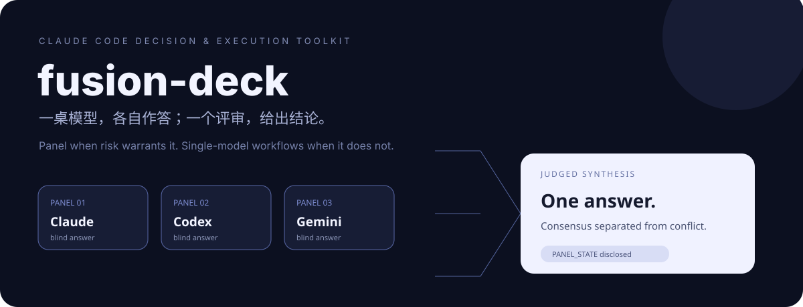
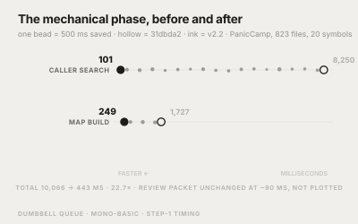
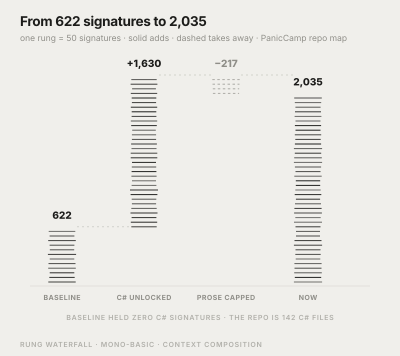
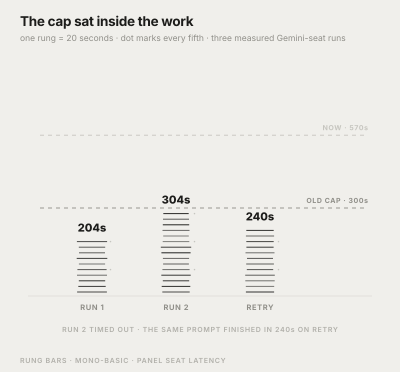
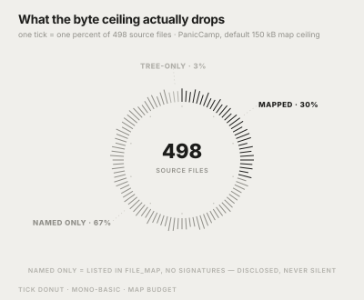
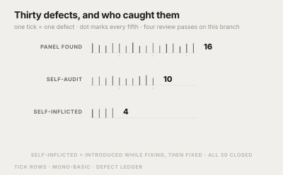

<p align="center">
  
</p>

# fusion-deck

<a href="https://github.com/raydocs/fusion-deck/releases/tag/v2.2"></a>
<a href="#development-verification"></a>


<a href="LICENSE"></a>

**A Claude Code decision-and-execution skill that spends extra models only when the risk earns it.** It can fan a hard question to independent panelists, keep answers blind, have Claude judge the result, and disclose the panel that actually ran. Around that core are mechanical workflows for planning, context curation, investigation, orchestration, optimization, refactoring, and handoff.

It is Markdown procedures plus Bash / Python helpers—not an MCP server, model dashboard, or OpenRouter replacement.

## Why a panel — the measured part

OpenRouter benchmarked this panel *shape* on **DRACO** (deep research, 100 tasks across 10 domains). Their numbers, for their Fusion pipeline, on the models of that era — fusion-deck runs the same shape locally but has **not** been independently benchmarked (different judge scaffolding, CLI-subscription model variants, and the seats now run newer models):

| Setup | DRACO | vs. best solo model |
| --- | --- | --- |
| **The panel shape fusion-deck runs** — Claude + GPT + Gemini, Claude judges | **68.3%** | **+3.0** |
| Claude + GPT pair, Claude judges | 67.6% | +2.3 |
| Best frontier model, solo | 65.3% | — (baseline) |
| GPT seat's model, solo | 60.0% | −5.3 |
| Judge's own model, solo | 58.8% | −6.5 |

Read it from the bottom up: the panel beats the **best** of its own members by 3 points, and beats its *average* member by far more — the judge's own model gains ~9.5 points from sitting on a panel instead of answering alone. Even the **same model run twice** cold and judged gains ~6.7. Independent tries catch each other's mistakes; that is the whole product.

*Data: OpenRouter, "[Fusion beats frontier](https://openrouter.ai/blog/announcements/fusion-beats-frontier/)". fusion-deck runs the panel via your own Claude / `codex` / `agy` subscriptions — no router, nothing leaves for a third party.*

## What a panel catches that one model reliably misses

These are mechanisms, not marketing — each maps to a specific instruction in `references/`:

- **Confident stale facts.** Models share training-data errors, so one model asking itself twice tends to agree with itself. A cross-family panelist that actually read the source contradicts the recitation, and the judge is instructed to settle it by **running the cheap check** — never by headcount (`judge-rubric.md`: "headcount is not adjudication").
- **Wrong-premise answers.** A single model usually answers *inside* your question's framing, even when the framing is the bug. Every panelist here is explicitly licensed to say "the premise is mistaken" instead of answering within it (`panel-prompt.md`).
- **Review blind spots.** In `/fusion-review`, findings that **two reviewers hit independently** are near-certain real (consensus = precision); findings only **one** family notices are exactly the ones a single reviewer run would have missed (unique insights = coverage). Disagreements don't get averaged away — the judge reads the disputed `file:line` and rules (in one internal run, two seats disagreed on whether a bare `except:` was intentional; the judge read the line — it swallowed `KeyboardInterrupt`).
- **Self-serving synthesis.** The judge writes its five-section analysis (consensus / contradictions / partial coverage / unique insights / blind spots) *before* drafting the final answer, so it can't decide first and rationalize after.
- **Fake panels.** A seat that errored, timed out, or returned a byte-sized error banner is reported **absent** — the answer must disclose the realized `PANEL_STATE` and the actual models that answered. Degraded runs never masquerade as premium.

## When it pays for itself

A panel costs roughly 3 model calls and a few minutes; it is priced for decisions where being wrong costs hours or days — an architecture choice you'd live with for months, a security-sensitive diff, a root cause you're about to "fix" at the wrong layer. For those, one avoided wrong call covers a long tail of panels. For trivia and routine edits, the skill's own router says: don't convene a panel — answer directly (`/fusion-auto` routes low-risk work to a single model by design).

## The context layer, measured

A panel is only as good as what its seats can see. Every seat gets the same mechanical repo map, the seats that can be sandboxed get a disposable snapshot of the code under review, and the timeouts stop lying about which knob controls them. All figures below are from this repo's own benchmarks — same run, same 20-symbol diff, `31dbda2` against `v2.2`. `scripts/charts/bench_step1.sh` re-runs the Step-1 timings; it works inside a disposable snapshot, which by construction has no gitignored build tree, so what it prints is a lower bound on a repo that has one.

<table>
<tr>
<td width="50%"></td>
<td width="50%"></td>
</tr>
<tr>
<td colspan="2">

**Where the time went.** Caller search dominated the old mechanical phase, and two things were wrong with it. It used `grep -rnw`, which reads `.git` and every gitignored build tree before filtering — `git grep` skips both, and on a repo with a large `node_modules` that step alone went from **491 s to 0.9 s**. And it spawned one process *per symbol*; a single multi-pattern pass does the same work once, with the per-symbol cap re-applied afterwards so one hot name still cannot eat the packet. Map build fell the same way: two shell `while read` loops over ~1,300 lines cost 823 ms of a 978 ms warm build on bash 3.2 loop overhead alone, and became one `awk` pass each.

**What the context gained.** The baseline map held **zero** C# signatures on a 142-file C# repo: the extension list and the signature pattern both missed modifier-led languages, and the run still exited 0. Prose now contributes a capped heading outline instead of empty blocks, which is the −217. A warm rebuild costs only the files whose content changed, so the map is rebuilt before every fan-out rather than cached and trusted.

</td>
</tr>
<tr>
<td width="50%"></td>
<td width="50%"></td>
</tr>
<tr>
<td colspan="2">

**Put the limit above the work, not beside it.** The Antigravity seat's own `--print-timeout` was hardcoded to 300 s while the documented `FUSION_PANEL_TIMEOUT` was 600 s — so the documented knob had no effect on that seat at all. Three measured runs landed at 204 / 304 / 240 s. The one that timed out finished in 240 s on retry, unchanged: the cap was mispositioned, not the prompt. Both layers now derive from one knob.

**Truncation is disclosed, never silent.** `file_map` is always complete — hiding that a file *exists* is the one thing a map must not do — so a file over budget is still named, just without signatures, and the run reports `MAP_STATE=TRUNCATED` with the count.

</td>
</tr>
</table>



**And the part worth being honest about.** This was built by running `/fusion-review` on itself, pass after pass. The panel caught **30** defects the author missed — a symlink that exfiltrated files from outside the repo, a worktree whose `.git` pointer walked a seat back to the live checkout, and a per-symbol cap that silently dropped a symbol's only call-site whenever it shared a hunk with a busier name. Nine more were introduced *while fixing* the others.

The sharpest data point is the optimisation pass. Before shipping it the author wrote a 12-case edge-condition suite — spaces in paths, dots in directory names, empty caches, brand-new symbols — and it found **nothing**. The panel then found six real defects in the same code, every one silent. The remediation for those was reviewed in turn, and the panel found eight more — including a *critical* one the first fix had opened: a symlink filter that closed the harmless shape and left the exfiltrating one, so a file outside the repo had its contents summarised into the artifact handed to every external seat.

Twice the author declared a defect fixed and the panel showed the fix closed only the reproduction case. Both times the suite was green. The author's tests probe the shapes the author has thought of — that is the failure mode a second reader exists to cover, and it is why the middle bar is not an embarrassment to hide.

<br clear="right">

## What ships

<!-- SYNCED FROM SKILL.md routing table — edit there first. -->
| Situation | Command | Default behavior |
| --- | --- | --- |
| Hard decision / trade-off | `/fusion` | Blind panel → judge |
| Let risk choose the workflow | `/fusion-auto` | Rule-based routing; escalate only when needed |
| Maximum-quality pass | `/fusion-ultra` | Wide panel, contradiction matrix, targeted probes, verifier |
| Review a diff or plan | `/fusion-review` | Panel-backed prioritized findings |
| Investigate a bug | `/fusion-investigate` | Evidence first; panel only if hypotheses survive |
| Turn a vague ask into a contract | `/fusion-plan` | Single-model Workflow Contract by default |
| Curate only relevant repo context | `/fusion-context` | Token-budgeted Context Pack |
| Execute a multi-step change | `/fusion-orchestrate` | Scoped agents with verify-before-next dispatch |
| Improve a measured metric | `/fusion-optimize` | Baseline → one change → re-measure |
| Preserve behavior while cleaning structure | `/fusion-refactor` | Analyze → plan → guided execution |
| Transfer work cleanly | `/fusion-handoff` | Handoff Capsule |
| Re-anchor a drifting session | `/fusion-remind` | Compact command / invariant map |

The exact contracts live in [`commands/`](commands/) and [`references/`](references/). The executable checks live in [`scripts/`](scripts/).

## Install

```bash
git clone https://github.com/raydocs/fusion-deck.git
bash fusion-deck/install.sh
```

By default this symlinks the repo to `~/.claude/skills/fusion-deck` and writes twelve wrappers to `~/.claude/commands/`. Then run `/reload-skills` in Claude Code or restart it.

Alternatives:

```bash
bash install.sh --copy       # install an allowlisted copy
bash install.sh --force      # replace an existing install
bash install.sh --uninstall  # remove skill + generated wrappers
```

`CLAUDE_SKILLS_DIR` and `CLAUDE_COMMANDS_DIR` override the destinations.

## Panel requirements and runtime honesty

Claude is the in-process panelist and judge. External seats are discovered from:

- `codex` for the GPT seat
- `agy` for the Gemini seat; legacy `gemini` is opt-in

A missing or failed seat is never silently presented as a full panel. Premium commands stop unless the required external CLIs are available; deliberate degraded execution requires `FUSION_ALLOW_DEGRADED=1`, and the result must still disclose `PANEL_STATE`. Runtime failures write a manifest and use a non-zero exit rather than fabricating success.

Check this machine without calling paid models:

```bash
bash scripts/detect_panel.sh
bash scripts/smoke_test.sh
```

## First use

```text
/fusion Should this checkout path use optimistic or pessimistic locking?
/fusion-auto review my staged diff
/fusion-plan add a health endpoint with tests
/fusion-context prepare the checkout code for another agent
/fusion-handoff authentication refactor
```

Use a panel for expensive-to-reverse judgment, not trivia. A common feature chain is:

```text
/fusion-plan → /fusion-context → /fusion-orchestrate → /fusion-handoff
```

## Safety boundaries

- Panel prompts may contain source code; review mode disables web access for untrusted diffs.
- Local ledgers live under `.fusion/runs/` and self-ignore; prompts and code should not be committed accidentally.
- Do not put credentials in prompts, Context Packs, command files, or manifests.
- All `scripts/…` paths in procedures resolve from the installed skill root, not the target project.

## The three lineages

fusion-deck fuses three lineages into one skill:

- **Panel → judge** (from fusion-fable): the same prompt goes to several models at once and blind, then the judge model writes the final answer. The pipeline can't be reversed.
- **Contract + honesty** (from the goal-meta lineage): an objective, finishing criteria defined before work, honest status states, and an escape hatch — emitted as a *Claude Code Workflow Contract* (not Codex's `/goal`).
- **Context + orchestration** (from RepoPrompt CE): a curated Context Pack, a shared plan, scoped subagent briefs, verify-then-dispatch-fresh, and a Handoff Capsule — plus evidence-first investigation, a measured optimize loop, behavior-preserving refactor, a tree-sitter→ctags→grep codemap, evidence-gated context discovery, and worktree isolation.

Cognition/Devin measured that delegation backfires when subtle intent matters — which is why the orchestrator keeps judgment and never implements, and why codemap/export stay thin helpers rather than a mini-RepoPrompt.

## Development verification

```bash
bash scripts/smoke_test.sh                                   # 307 assertions, offline
python3 scripts/route_task.py --check tests/router_cases.yml
node scripts/charts/gen_readme_charts.js assets/readme/charts # regenerate the README charts
```

The smoke test is offline and must not invoke paid model calls. The chart generator is deterministic —
re-running it on unchanged data produces a byte-identical result, so a dirty `git diff` there means the
numbers moved.

## License

[MIT](LICENSE)
